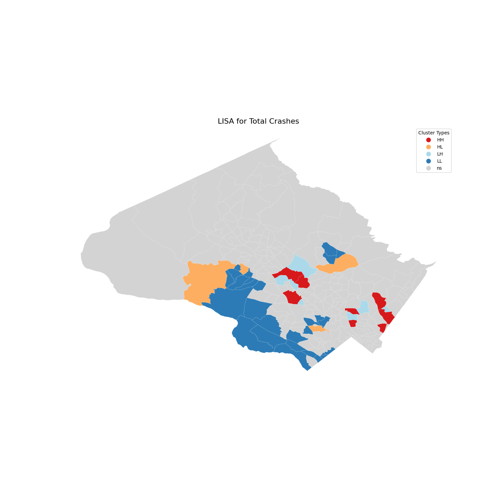

# Identifying High-Risk Areas for Traffic Collisions in Montgomery, Maryland
[Full paper](artifacts/Identifying%20High-risk%20areas%20for%20traffic%20collisions%20in%20Montgomery.pdf)

This repository presents the findings and methodologies from the study **"Identifying High-Risk Areas for Traffic Collisions in Montgomery, Maryland Using KDE and Spatial Autocorrelation Analysis"**. The study investigates spatial patterns of road traffic collisions in Montgomery County, Maryland, from 2015 to 2024, using geospatial statistical techniques to identify hotspots and clusters.

## Abstract
Despite a global decline in motor vehicle crash fatalities due to improved research and road safety policies, road traffic injuries remain a significant public health concern. The World Health Organization's 2023 report highlights [1] that road traffic injuries are the leading cause of death among individuals aged 5-29, with over half of fatalities involving pedestrians, cyclists, and motorcyclists. This study addresses this critical issue by identifying high-risk areas in Montgomery County, Maryland, contributing to the global goal of halving road traffic deaths and injuries by 2030. Using Kernel Density Estimation (KDE) and spatial autocorrelation analysis, we estimate collision densities and identify hotspots for targeted interventions. Our findings reveal significant spatial clustering of traffic collisions, with distinct patterns in densely populated urban areas and rural regions, offering valuable insights for policymakers to enhance road safety.

**Keywords: Road collisions analysis; Spatial Autocorrelation; Geographic Information System; Hotspots detection**

*Figure 1: Collision density KDE for total crashes and severe only crashes*

*Figure 2: LISA for crashes in cencus tracts (significance level = 0.05)*

